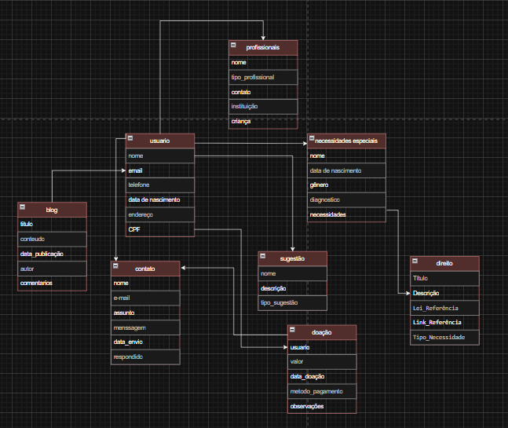
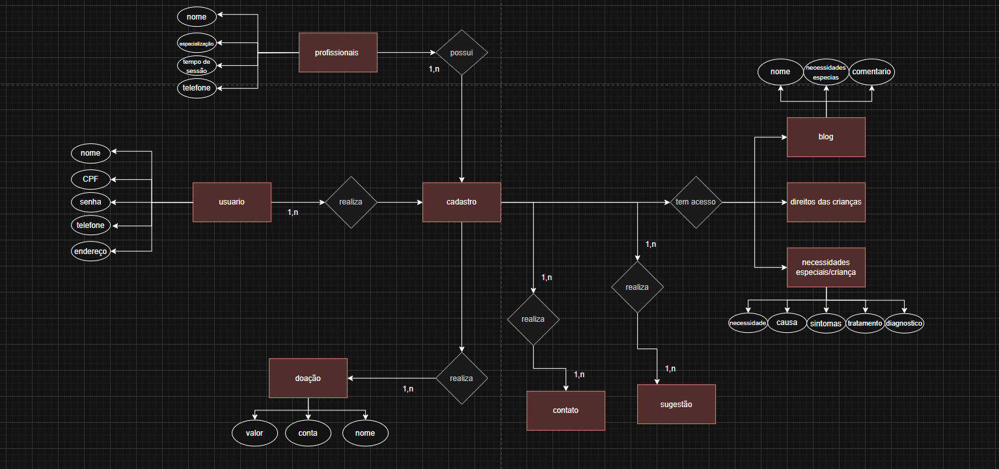
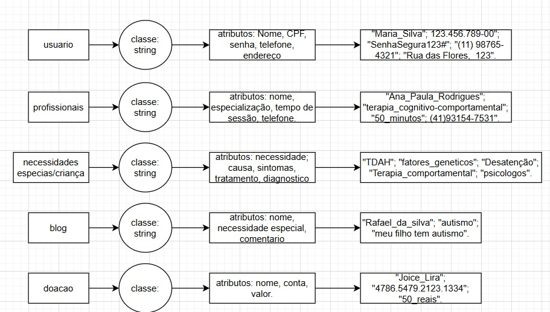
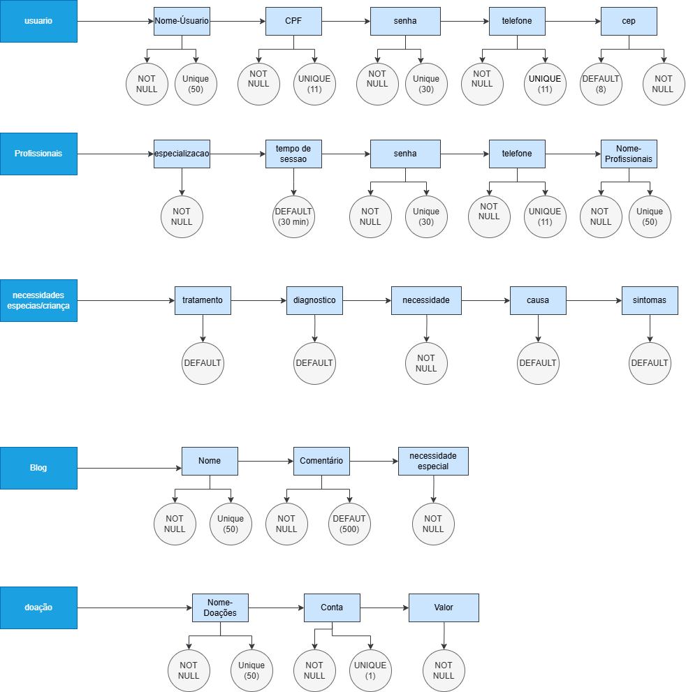

# Special Family  

## Proposta  

O Special Family tem como objetivo ajudar famílias de crianças atípicas.Crianças neurodivergentes recebem apoio como fisioterapia, fonoaudiologia, terapia e vários outros. Mas e os pais? Os irmãos? Os avôs? Todos merecem apoio!
O nosso site disponibiliza apoio como informações sobre o transtorno, dicas do dia a dia, quais os direitos das crianças/famílias atípicas, livros e artigos com informações, ajuda com o desenvolvimento, uma comunidade de pais, psicólogos disponíveis para ajudar, entre outras. Queremos oferecer o apoio que essas pessoas precisam e que não conseguem achar com facilidade!

## Banco de dados/back  

Nosso banco de dados e back foi feito na proposta de atender as familias da forma mais rapida e melhor, neles contemos diagramas e variaveis.

 

--------------------

## Design  

Nosso design foi pensado para atender todos os tipos de clientes, desde mais velhos a ate mais novos, com cores e paletras agradaveis visualmente podemos atrair todo o tipo de publico para o nosso site. O design dele foi pesando tambem para ser de facil acesso e agil, tendo funções bem destacadas e diretas, dificilmente ficaram perdidos no nosso site!

 

 

 

 

 

 

 

 

 

 

 

 

 

 

 

 

 

 

 

 

 

 

 

 

 

 

 

 
